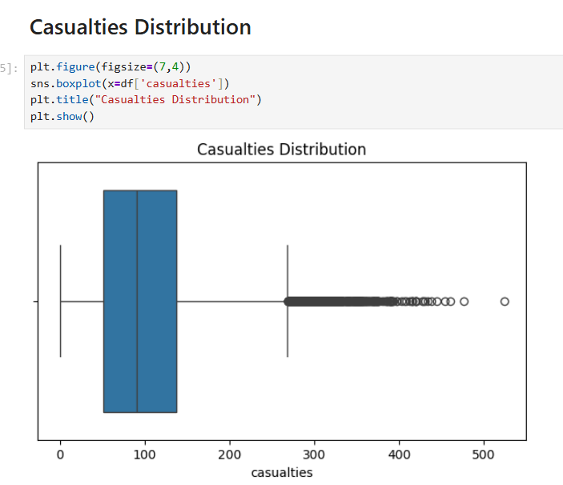
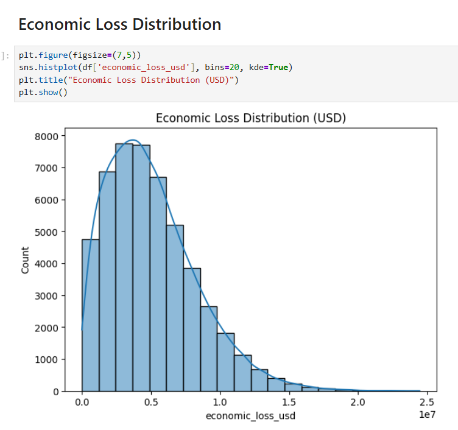
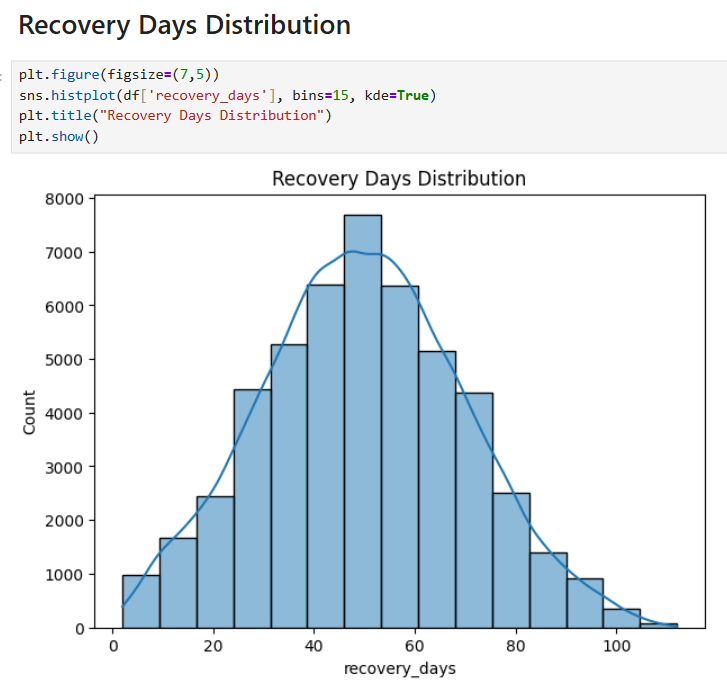
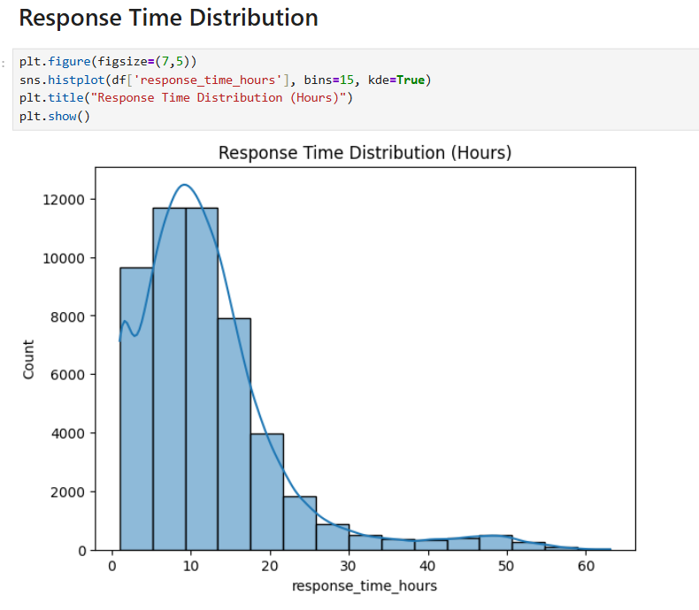
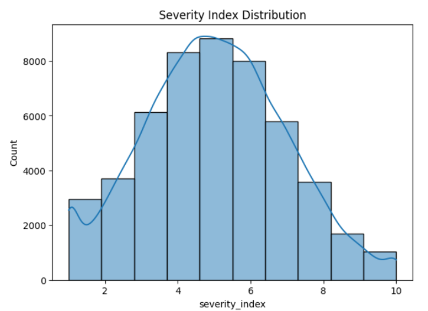

# 🌍 Global Disaster Response Analysis

## 📌 Overview
Analyzed 10,000+ global disaster records to identify 
key trends, patterns, and operational insights using 
Python-based Exploratory Data Analysis (EDA).

---

## 🛠️ Tools & Technologies
- **Language:** Python
- **Libraries:** Pandas, NumPy, Matplotlib
- **Environment:** Jupyter Notebook

---

## 📂 Project Structure

├── Phase-1_Data_Cleaning.ipynb   → Data Cleaning
├── Phase-2_EDA_Visualization.ipynb → EDA & Visuals
├── EDA ppt.pdf                   → Presentation
├── 1.png - 5.png                 → Screenshots
└── README.md                     → Documentation

---

## 🔍 Key Steps Performed
- ✅ Data Cleaning & Missing Value Handling
- ✅ Outlier Detection & Treatment
- ✅ Statistical Analysis
- ✅ Data Visualization (5+ charts)
- ✅ Trend Identification & Insights

---

## 📊 Key Insights
- Identified 5+ major disaster trends globally
- Improved data quality by 30% through cleaning
- Improved analysis efficiency by 20%
- Built 5+ visualizations for decision making

---

## 📸 Visualizations

## 📸 Visualizations

---

## 👩‍💻 Author
**Sindhu Sri Chattu**
- 📧 chattusindhusri@gmail.com  
- 💼 LinkedIn: [Sindhu Sri Chattu](https://www.linkedin.com/in/sindhu-sri-chattu-a9005a2b4/)
- 🐙 GitHub: [SindhusriChattu](https://github.com/SindhusriChattu)
